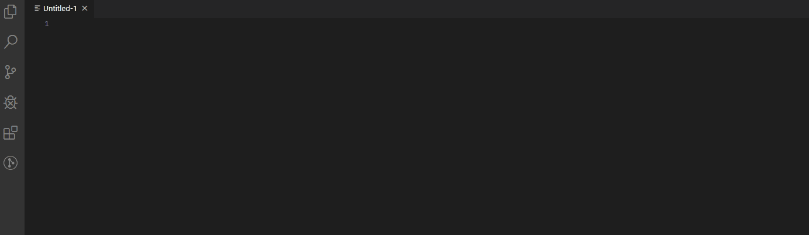
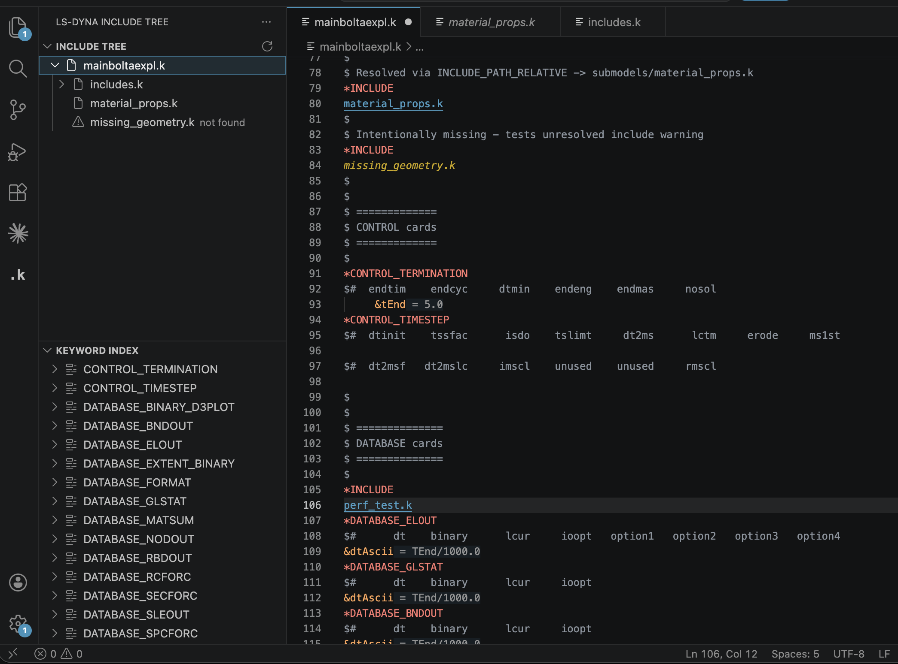

# VS Code LS-DYNA extension
[简体中文](README_zh.md)

> [!NOTE]
> **Customized Version Notice (Modified by hqyyqh)**
> This extension is a customized version based on the original [vscode-lsdyna](https://github.com/osullivryan/vscode-lsdyna) developed by Ryan O'Sullivan ([osullivryan](https://github.com/osullivryan)).
> - **Modifier:** hqyyqh (Modified starting May 2026)
> - **Source Code:** [hqyyqh/vscode-lsdyna](https://github.com/hqyyqh/vscode-lsdyna)
> - **License:** Distributed under the GNU General Public License v3.0 (GPL-3.0). All original licenses and credits are preserved.


## Integrates [LS-DYNA](https://www.lstc.com/) into VS Code.

This extension integrates LS-DYNA formatting, keyword snippets, and language tooling into VS Code.

### Example


### Features

**Syntax & Navigation**
- Syntax highlighting for `.k`, `.key`, and `.dyna` files
- Keyword folding — each `*KEYWORD` block collapses independently
- Jump to next/previous keyword: `Ctrl+Alt+Down` / `Ctrl+Alt+Up`
- Select the current keyword block via the right-click context menu
- Word wrap off by default for fixed-width column alignment
- Default editor rulers (field markers) for LS-DYNA to visualize columns, with an optimized, non-intrusive color palette

**Include Files**
- `*INCLUDE` filenames are highlighted green (resolved) or red (missing), including continued filenames and multiple files listed under one exact `*INCLUDE` block
- Right-click an include filename → **Open \*INCLUDE File**, or Ctrl/Cmd+Click
- Resolves `*INCLUDE_PATH`, `*INCLUDE_PATH_RELATIVE`, and `../` style relative paths
- Autocomplete for same-directory include paths (triggered by slash `/` or backspace, automatically filtering out remote/invalid paths)
- Hover actions on include files to jump or inspect target file details

**Parameters**
- Go to Definition and Find All References for `&parameter` names (Ctrl/Cmd+Click)
- Rename parameter across the file (F2)
- Inlay hints show the resolved value of each `&parameter` reference inline
- "N references" CodeLens above each parameter definition — click to open the References panel
- Bare variable names in `*PARAMETER_EXPRESSION` values are highlighted the same color as `&param` references

**LS-DYNA Manual Integration**
- Bookmark-based PDF manual indexing (`manualIndexer`) and cache for instant search
- Interactive hover cards: Keyword and field hovers display links to the exact page of the LS-DYNA PDF manual
- `openManual` command to easily jump to specific manual pages
- Bundled SumatraPDF support (Windows) featuring tab recycling, single-instance routing, and page-precision navigation

**Sidebar Panel**
- **Include Tree** — recursively scans all `*INCLUDE` files and displays them as a tree; exact `*INCLUDE` blocks may contain multiple file entries. Features:
  - Global file decorations (`FileDecorationProvider`) tracking resolved and missing files
  - Modernized visual indicators replacing emoji with block bars (`▏`, `▌`, `█`)
  - Formatted file sizes shown directly in description labels and right-hand badges
- **Keyword Index** — shows all keywords used in the current file (local mode) or the full include tree (recursive mode). Large indices (e.g., millions of `*NODE` coordinates) are automatically grouped by file and folded above a certain threshold, ensuring clean lists and fluid UI response. Toggle between modes with the toolbar buttons.


**Diagnostics**
- Lines exceeding 80 characters (excluding comments) are flagged as warnings.
- Circular include loops are flagged as errors directly on the offending `*INCLUDE` lines.
- Missing include files are flagged as warnings directly on their inclusion lines.
- Diagnostics are updated incrementally at the block level on keystrokes.

**Performance & Architecture**
- **LSP Process Isolation** — Heavy scans and worker thread indexing pools run out-of-process in a separate Language Server, guaranteeing 0% UI blockage.
- **L2 Persistent Disk Cache** — Caches project snapshots locally in the workspace global storage directory. Re-opens projects instantly with LRU cache eviction and auto-vacuuming to control disk size.
- **Incremental Block-level Parsing** — Keeps active document keywords updated instantly on keystrokes by parsing only the modified keyword block ranges (using a fast block scanner and range-shifting block index).
- **High-Performance Binary Scanners** — Core scanners are optimized using binary buffer sliding scans (`keywordScanner`), binary buffer column-1 matching (`blockScanner`), and selective line decoding inside include blocks (`includeScanner`).
- **Large File Optimization** — Lifted keyword and include tree thresholds for large files with fallback language detection, and used `vscode.open` instead of `openTextDocument` to prevent UI freezing.

**Snippets**
- Tab-completable snippets for common LS-DYNA keywords

**LS-PrePost**
- Syntax highlighting for `.cfile` command files

### Settings

The extension respects standard VS Code settings. Some useful ones for LS-DYNA files:

| Setting | Default | Description |
|---|---|---|
| `editor.hover.enabled` | `true` | Show keyword and field hover tooltips |
| `editor.inlayHints.enabled` | `on` | Show resolved parameter values inline |
| `editor.codeLens` | `true` | Show "N references" above parameter definitions |
| `editor.wordWrap` | `off` | Word wrap (off by default for fixed-width columns) |
| `lsdyna.sumatrapdfPath` | `""` | Custom SumatraPDF executable path (Windows only) for precise page-level manual navigation. |

These can be scoped to LS-DYNA files only by adding them under `"[lsdyna]"` in your `settings.json`:

```json
"[lsdyna]": {
    "editor.hover.enabled": false,
    "editor.inlayHints.enabled": "off"
}
```

### Keyword Data

Snippets and hover documentation are generated from the [pydyna](https://github.com/ansys/pydyna) keyword database (`kwd.json`), which is maintained by Ansys and covers 3168 LS-DYNA keywords with full field definitions, types, defaults, and help text. This data is used at build time only — it is not bundled in the extension.

To regenerate after updating pydyna:

```bash
# Clone pydyna as a sibling of this repo (one-time setup)
git clone https://github.com/ansys/pydyna ../pydyna

# Regenerate snippets and hover field data
python keywords/generate_from_pydyna.py
```

This overwrites `snippets/lsdyna.json` and `keywords/field_data.json`.

### Contributing new Keywords

There are a few ways you can go about adding keywords or features:

1. Send me an email or message on Github with the desired keyword (and an example).
2. Make a pull request:
    1. Create a fork of the master.
    2. Clone [pydyna](https://github.com/ansys/pydyna) as a sibling directory (`../pydyna`).
    3. Run `python keywords/generate_from_pydyna.py` from the repo root to regenerate `snippets/lsdyna.json` from the full pydyna keyword database (3168 keywords).
    4. Create a new pull request to merge your branch into master.

### Contributors

- [osullivryan](https://github.com/osullivryan) (Original Author)
- [hqyyqh](https://github.com/hqyyqh) (Customized Version Maintainer)
- [yshl](https://github.com/yshl)
- [maxiiss](https://github.com/maxiiss)

### Some References

[vim-lsdyna](https://github.com/gradzikb/vim-lsdyna)  
[DCHartlen's vscode extension](https://github.com/DCHartlen/LSDynaForVSCode)