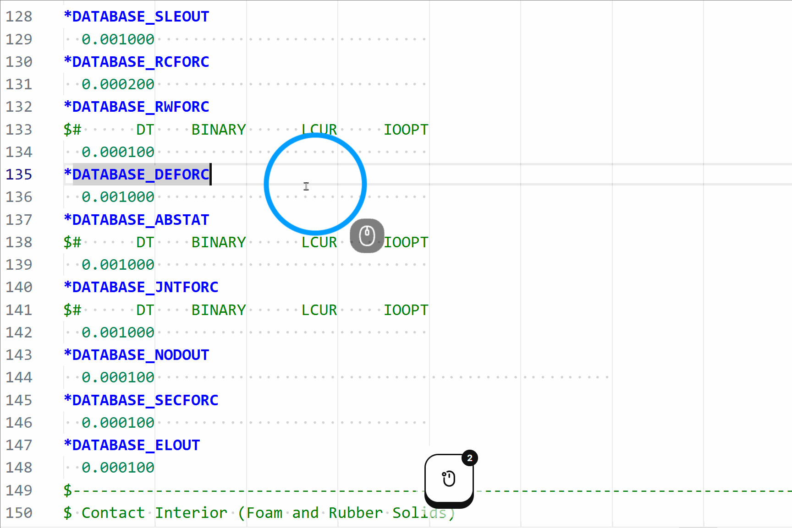
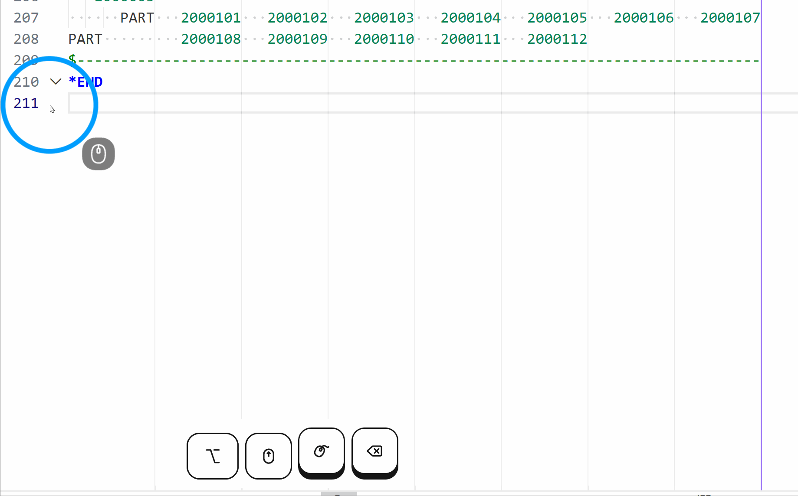
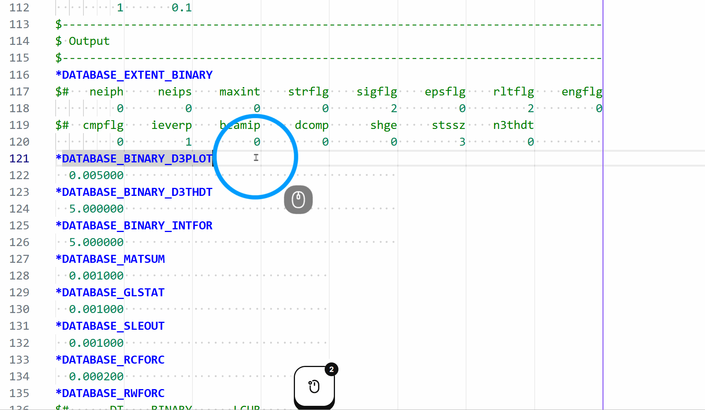
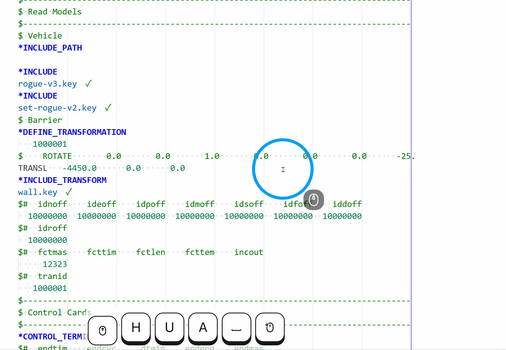

# VS Code LS-DYNA 扩展
[English](README_en.md)

> [!NOTE]
> **定制版本声明（由 hqyyqh 修改）**
> 本插件是基于 Ryan O'Sullivan 开发的原版 [vscode-lsdyna](https://github.com/osullivryan/vscode-lsdyna) 插件的定制分支，添加了特定的定制化功能。
> - **修改者：** hqyyqh（自 2026 年 5 月起进行修改）
> - **源码仓库：** [hqyyqh/vscode-lsdyna](https://github.com/hqyyqh/vscode-lsdyna)
> - **开源协议：** 遵循 GNU General Public License v3.0 (GPL-3.0) 协议。我们保留并尊重原作者的所有版权与贡献声明。


## 将 [LS-DYNA](https://www.lstc.com/) 集成到 VS Code 中。

此扩展将 LS-DYNA 格式化、关键字代码片段以及语言工具集成到了 VS Code 中。

### 安装

请访问项目的 [Releases 页面](https://github.com/hqyyqh/vscode-lsdyna/releases) 下载最新的 `.vsix` 插件安装包，并在 VS Code 中选择“从 VSIX 安装”。具体的依赖配置与常见问题，请参考该页面的安装说明。

### 功能特性

**语法与导航**
- 针对 `.k`、`.key` 和 `.dyna` 文件的语法高亮
- 关键字折叠 — 每个 `*KEYWORD` 块均可独立折叠
- 跳转到下一个/上一个关键字：`Ctrl+Alt+Down` / `Ctrl+Alt+Up`
- 通过右键上下文菜单选择当前的关键字块
- 支持通过设置将自定义文件后缀映射为 LS-DYNA 语言模式


**包含文件 (*INCLUDE)**
- `*INCLUDE` 文件名高亮显示为绿色（已解析）或橙色（缺失），支持续行文件名以及在单个 `*INCLUDE` 块下列出的多个文件
- 支持解析 `*INCLUDE_PATH`、`*INCLUDE_PATH_RELATIVE` 以及 `../` 等相对路径
- 同目录包含路径的自动补全（支持通过斜杠 `/` 或退格键触发，自动过滤掉无效/远程路径）
  
- 在包含文件路径上支持悬停操作，可快速跳转或查看目标文件详情


**参数 (*PARAMETER)**
- 在整篇文件中对参数进行重命名 (F2)
- 内联提示 (Inlay hints) 实时显示每个 `&parameter` 引用的解析值
- 在每个参数定义上方显示“N 个引用”的 CodeLens — 点击可打开引用面板


**LS-DYNA 手册集成**
- 基于 PDF 书签实现即时检索
- 交互式悬停卡片：关键字和字段的 Hover 提示卡片内提供了直达 LS-DYNA PDF 手册对应页码的链接
- 悬停卡片包含关键字各字段的具体说明
  

**侧边栏面板**
- 递归扫描所有 `*INCLUDE` 文件并以树状图展示
- 展示当前文件使用的所有关键字。


**智能补全与格式化**
- 针对常用 LS-DYNA 关键字提供支持 Tab 键补全的代码片段
  
- **智能 Tab 导航**：按下 `Tab` 键即可将字段对齐至其实际物理列宽、在当前行的各字段间循环，并平滑地自动换行
  
- **注释补全**：使用 `$` 或 `#` 触发字段注释的自动生成，完美右对齐且无尾随空格
  
- 自动格式化数据行
  

**LS-PrePost**
- 针对 `.cfile` 命令文件的语法高亮

### 设置

该扩展除了遵循标准的 VS Code 设置外，还提供了一些专属的配置选项。

**LS-DYNA 专属设置：**

| 设置项 | 默认值 | 描述 |
|---|---|---|
| `lsdyna.language` | `"zh-cn"` | 选择插件的界面语言和悬浮提示语言（支持 `zh-cn` 和 `en`） |
| `lsdyna.manualsDir` | `""` | 包含 LS-DYNA PDF 手册的目录路径（绝对或工作区相对路径）。在 Windows 系统上，请将 `SumatraPDF.exe` 复制到该目录下以启用精确页码跳转。 |
| `lsdyna.additionalExtensions` | `[".k", ".key", ".dyna", ".asc"]` | 需要额外关联到 LS-DYNA 语言模式的文件后缀名 |

**VS Code 常用建议设置：**

| 设置项 | 默认值 | 描述 |
|---|---|---|
| `editor.hover.enabled` | `true` | 显示关键字及字段悬停提示卡片 |
| `editor.inlayHints.enabled` | `on` | 内联显示解析后的参数值 |
| `editor.codeLens` | `true` | 在参数定义上方显示“N 个引用” |
| `editor.wordWrap` | `off` | 自动换行（对齐固定宽度列时默认关闭） |

可以通过在 `settings.json` 的 `"[lsdyna]"` 下添加这些设置，来使其仅对 LS-DYNA 文件生效：

```json
"[lsdyna]": {
    "editor.hover.enabled": false,
    "editor.inlayHints.enabled": "off"
}
```

### 关键字数据

代码片段和悬停文档基于 [pydyna](https://github.com/ansys/pydyna) 关键字数据库（`kwd.json`）生成，该数据库由 Ansys 维护，涵盖了 3168 个 LS-DYNA 关键字，包含完整的字段定义、类型、默认值和帮助文本。此数据仅在构建时使用，不打包在扩展中。

若要在更新 pydyna 后重新生成：

```bash
# 将 pydyna 克隆为该仓库的同级目录（一次性设置）
git clone https://github.com/ansys/pydyna ../pydyna

# 重新生成代码片段和悬停字段数据
python keywords/generate_from_pydyna.py
```

此操作将覆盖 `snippets/lsdyna.json` 和 `keywords/field_data.json`。

### 贡献新关键字

你可以通过以下几种方式来添加关键字或功能：

1. 向我发送电子邮件或在 GitHub 上发消息说明所需的关键字（并附带示例）。
2. 发起 Pull Request：
    1. Fork 本仓库的 master 分支。
    2. 将 [pydyna](https://github.com/ansys/pydyna) 克隆为本仓库的同级目录 (`../pydyna`)。
    3. 从仓库根目录运行 `python keywords/generate_from_pydyna.py`，从完整的 pydyna 关键字数据库（包含 3168 个关键字）重新生成 `snippets/lsdyna.json`。
    4. 创建一个新的 Pull Request，将你的分支合并到 master。

### 贡献者

- [osullivryan](https://github.com/osullivryan) (原作者)
- [hqyyqh](https://github.com/hqyyqh) (定制版维护者)
- [yshl](https://github.com/yshl)
- [maxiiss](https://github.com/maxiiss)

### 参考链接

[vim-lsdyna](https://github.com/gradzikb/vim-lsdyna)  
[DCHartlen 的 vscode 扩展](https://github.com/DCHartlen/LSDynaForVSCode)
