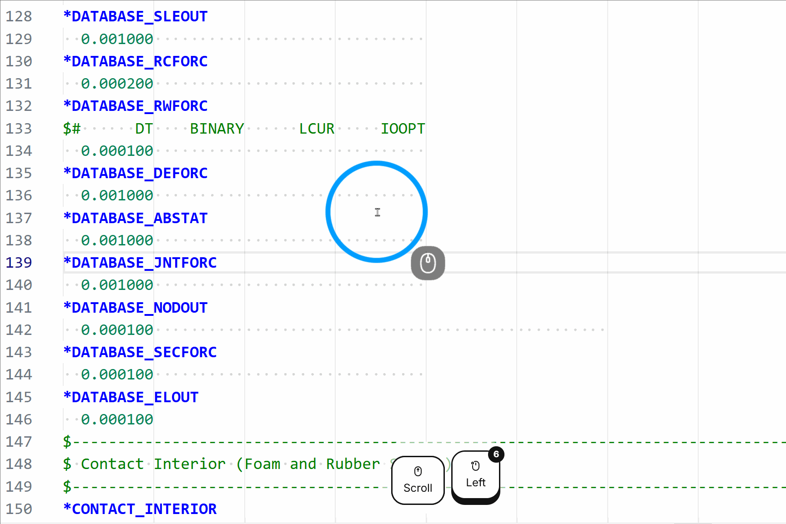

# DynaSense (LS-DYNA Studio)

<div align="center">
  
  <h3>An LS-DYNA deck editor for VS Code</h3>
  <p>Built for CAE engineers: keyword and field help, Include Tree navigation, fixed-width card editing, and local manuals.</p>

[](https://marketplace.visualstudio.com/items?itemName=hqyyqh.dynasense)
[](https://open-vsx.org/extension/hqyyqh/dynasense)
[](https://opensource.org/licenses/GPL-3.0)

</div>

[English Version](README.md) | [中文说明](README_zh.md)

---

## Quick start (about one minute)

1. **Open a deck** — open any `.k` / `.key` / `.dyna` file, whether it is a main deck or an included file.
2. **Insert a keyword** — type `*` to choose from more than 4,700 keywords with ready-made card layouts.
3. **Edit fixed-width fields** — on a data line, press `Tab` / `Shift+Tab` to move by the actual field widths. With field protection enabled by default, Delete clears the selected field without shifting later fields; typing after Tab replaces only that field.
4. **Read field help** — hover a keyword or field for meaning, type, width, and defaults.
5. **See the model tree** — open the **LS-DYNA** activity bar → **Include Tree**, then scan from your main file to walk every `*INCLUDE`.
6. **Configure manuals (optional)** — set `lsdyna.manualsDir` to a manual pack (see [Manual setup](#manual-integration-setup)) for PDF page jumps and the in-editor manual reader.

> **Preview**
>
> | Keyword completion | Hover help |
> | :---: | :---: |
> |  |  |

---

## What you can do day to day

### Keyword cards, columns, and formatting

- **Keyword coverage** from the open-source [ansys/pydyna](https://github.com/ansys/pydyna) data (more than 4,700 keywords).
- **Snippets** insert a formatted keyword block so you do not start from a blank line.
- **Tab navigation** moves between 10-character (or 8-character where applicable) fields; optional wrap to the next line.
- **Field-header comments**: type `$` or `$#` to generate right-aligned field labels without trailing spaces.
- **Line comments**: `Ctrl+/` toggles `$` at column 1, where LS-DYNA expects the comment marker.
- **Format a selection or document** into the standard fixed-width layout. The experimental `lsdyna.autoFormat` can format a line when the cursor leaves it; it is off by default because it rewrites card spacing automatically.

> **Demos**
>
> | Keyword | Include path |
> | :---: | :---: |
> |  |  |
> | **Comments** | **Tab** |
> |  |  |
> | **Format** | |
> |  | |

### `*INCLUDE` paths — browse, complete, and check

Typical full-vehicle decks are split across many folders (`mats/`, `assembly/`, `loadcases/`, and others). DynaSense resolves include paths against the applicable **search roots**, instead of matching only bare filenames.

**Path completion under `*INCLUDE` (not under `*INCLUDE_PATH`):**

1. Go to the filename line under `*INCLUDE`.
2. Type `/` or `\` to list the **next folder level** under the search roots: the current deck directory plus existing directories from `*INCLUDE_PATH` and `*INCLUDE_PATH_RELATIVE`.
3. Keep typing after the separator (for example `/ma`) to filter **that level only**, or pick a folder (paths end with `/`) and type `/` again to go deeper. Browse results keep folders first and use natural ordering (`1`, `2`, `10`).
4. Or start with a **bare file-name fragment** containing no path separator (for example `LC_Front`) to search recursively. Matching files appear with their **full relative path** so two different `mat.k` files stay distinguishable.
5. Accepting a suggestion inserts a path with **forward slashes** (`loadcases/frontal/run.k`) for portability to Linux solvers.

An empty filename line under `*INCLUDE` does **not** list the whole project. Start with `/` to browse, or type part of a filename to search. The usual workflow does **not** require `Ctrl+Space`.

**`*INCLUDE_PATH` in a typical full-vehicle deck**

- A common layout declares `*INCLUDE_PATH` only in the **main deck** or an early setup file. Included files then use short names such as `steel.k` without repeating the path cards.
- When you **scan the Include Tree from the main deck**, included files inherit search directories declared by their ancestors, so short names can resolve without duplicated path cards.
- If you **open only an included file** and have not scanned from its main deck, the search roots are local to that file: its directory plus its own path cards. A missing-path indicator can therefore mean that no main-deck context is available, rather than that the path is wrong.
- **After a scan from the main deck**, file navigation, path status, editor links, and `*INCLUDE` completion reuse the inherited search paths recorded by that scan.
- DynaSense does **not** combine every `*INCLUDE_PATH` in the workspace. Doing so could mix load-case directories and incorrectly mark missing files as resolved.

**Include path status**

- An **underlined link** means the file or directory was found locally and can be opened. No extra success badge is added.
- A path without a link plus a trailing **!** means it is not available under the current local search paths (wrong name, wrong `*INCLUDE_PATH`, a server-only file, or a file not checked out).
- **Include Tree** shows the hierarchy from the main deck; the same file may appear under more than one parent if several cards include it (normal for shared materials) — that is **not** a cycle by itself.
- **Circular include** (A includes B and B includes A, or a longer loop) is marked on the tree and reported as an **error** so you can fix the deck before a long solver run.
- Hover an include path for a short **file header preview** without fully opening meshes with millions of lines.
- Include paths that exceed LS-DYNA's three-line, 236-character limit raise a diagnostic before the solver silently truncates them.

**Windows preprocessing to Linux solving**

On Windows, `sub/part.k` may open even when the path on disk is `Sub/Part.k`. LS-DYNA on Linux usually needs an **exact** case match. With the default `lsdyna.include.pathCaseCheck` value, `crossPlatform`, local navigation still works, but DynaSense reports a warning and offers a Quick Fix. Set the option to `strict` before submitting a Linux job when path case must be enforced.

### Manuals, hover, and PDF

- Hover keywords/fields for help; with a manual pack configured, open the matching **PDF page** (bookmark-based).
- **Bilingual pack**: in-editor reader with EN/中文 when the pack contains Chinese content; **English-only pack**: reader stays English (no fake Chinese toggle).
- The **document body** can use only the languages supplied by the pack. Toolbar labels follow the extension UI language setting.

### Parameters, navigation, and “unknown” keywords

- `*PARAMETER` lines show reference counts above the keyword; supported keywords also offer suffix helpers such as `_TITLE`.
- Hover `&name` to see the resolved value (within the current document’s parameter definitions).
- `F2` rename for parameters in the document; `Ctrl+Alt+Up` / `Down` jump previous/next keyword.
- Folding and highlighting for `.k`, `.key`, `.dyna`, `.cfile`, and extra extensions you associate.
- The built-in keyword library can lag a new LS-DYNA release. Add confirmed keywords to the custom valid list from a hover, Quick Fix, or DynaSense quick actions, or lower `lsdyna.unknownKeywordSeverity`.

| Include tree | Include hover |
| :---: | :---: |
|  |  |


---

<a id="manual-integration-setup"></a>

## Manual setup (PDF + in-editor reader)

PDF manuals are **not** included in the `.vsix` because of package size limits. Point `lsdyna.manualsDir` at a **pack root**: either the folder containing `manifest.json` in a pre-built pack, or a folder containing your PDFs and, on Windows, SumatraPDF.

### Option A — Pre-built pack (recommended)

Packs are published on the project **[GitHub Releases](https://github.com/hqyyqh/vscode-lsdyna/releases)** page. Prefer the **newest** release assets; older zip names in historical posts may differ.

| Pack flavor | Typical folder name | What you get |
| --- | --- | --- |
| **Bilingual** | `lsdyna-manual-pack-bilingual` | English + Chinese documents, Chinese search, sentence-level translation hover; language toggle available when Chinese content exists |
| **English only** | `lsdyna-manual-pack-en` | English documents and search; smaller download; **no** Chinese body toggle (expected) |

**Steps**

1. Download the zip for your flavor from the latest Release.
2. Extract it somewhere stable (SSD path is fine).
3. In VS Code, use the settings button in a keyword hover, run **Set LS-DYNA Manuals Directory**, or edit `lsdyna.manualsDir`. Select the **extracted pack root** containing `manifest.json`.
4. Run **LS-DYNA: Open Manual Reader**, or open a section from the **Manuals** view in the LS-DYNA activity bar.

The reader opens **beside** the deck editor by default so you can compare cards with the manual.

> **For Chinese manual content:** install the **bilingual** pack.
> **English-only workflows:** the **en** pack is enough.

Legacy zip names such as `lsdyna_manual_pack_en.zip` may still appear on older release tags; if a link 404s, use the latest Release list.

### Option B — Your own PDFs

1. Download manuals from the [Ansys LS-DYNA manuals page](https://lsdyna.ansys.com/manuals-download/).
2. On Windows, download **portable** [SumatraPDF](https://www.sumatrapdfreader.org/free-pdf-reader) and place `SumatraPDF.exe` in the same folder as the PDFs (or in a `pdf/` subfolder).
3. Set `lsdyna.manualsDir` to that folder.

> **Important:** page jump uses **PDF bookmarks**. Renaming files is fine; stripping bookmarks after merge/edit breaks precise jumps.
> If SumatraPDF is missing, the system PDF app may open but often **ignores** the requested page number.

---

## Settings (common for vehicle projects)

### Theme colors

Syntax colors for comments, keywords, numbers, strings, parameters, and paths come from the active VS Code theme through standard TextMate scopes. Editor links, warnings, tree warnings, rulers, and webviews likewise use VS Code semantic theme colors. DynaSense supplies its own colors only for session change marks and concrete SVG/animation fallbacks; all four VS Code theme classes (light, dark, high contrast, and high contrast light) have separate defaults.

Change-mark colors in the overview ruler and minimap can be overridden with `workbench.colorCustomizations` (the gutter SVG keeps the matching four-theme fallback because VS Code does not expose resolved custom colors to SVG data URIs):

```json
{
  "workbench.colorCustomizations": {
    "lsdyna.changeMarks.unsaved": "#d18616",
    "lsdyna.changeMarks.saved": "#4caf50"
  }
}
```

| Setting | Default | In practice |
| :--- | :--- | :--- |
| `lsdyna.manualsDir` | `"lsdyna_manual_pack"` | Folder of your manual pack or PDFs. After extract, set this to the real pack root (for example `…/lsdyna-manual-pack-bilingual`). |
| `lsdyna.include.pathCaseCheck` | `"crossPlatform"` | Keep the default for Windows preprocessing. Use `"strict"` before submitting a Linux job when path case must match. |
| `lsdyna.customValidKeywords` | `["*END","*TITLE","*CASE_BEGIN","*CASE_END"]` | Site-specific or new solver keywords that should not be reported as unknown. A trailing `*` matches a prefix. |
| `lsdyna.unknownKeywordSeverity` | `"error"` | Use `warning` / `hint` / `off` if the library lags your solver version. |
| `lsdyna.warnLowercaseKeyword` | `false` | Warn on lowercase keywords (e.g. `*node`). LS-DYNA is case-insensitive; enable only if your team enforces an uppercase house style. |
| `lsdyna.enableTabNavigation` | `true` | Tab jumps fields; turn off if you want normal Tab spaces. |
| `lsdyna.enableCellEditProtect` | `true` | Delete/Backspace clears a selected card field with spaces. Typing replaces the whole field **only after Tab selects it**; `*` and `$` always use standard editing. Independent of Tab navigation. |
| `lsdyna.enableFieldHover` | `true` | Field help on hover for card columns. Turn off for quieter editing; re-enable from the DynaSense status bar menu. |
| `lsdyna.changeMarks.enabled` | `true` | Session marks in the glyph margin: theme-aware amber = unsaved, green = saved since open; **a status dot also marks unsaved state**, so this distinction is not color-only. Solid = modified, hollow = inserted, triangle = deleted (on neighbor line). |
| `lsdyna.changeMarks.maxLineCount` | `100000` | Skip marks above this line count (very large mesh decks). |
| `lsdyna.changeMarks.debounceMs` | `250` | Delay after typing before recomputing marks. |
| `lsdyna.changeMarks.showOverviewRuler` | `true` | Also paint marks on the overview ruler. |
| `lsdyna.changeMarks.showLineBackground` | `true` | Very light **whole-line** tint on marked lines; turn off for gutter-only. |
| `lsdyna.changeMarks.showMinimap` | `true` | Dual-color minimap (orange = unsaved, green = saved since open). Shape detail stays on the gutter. |
| `lsdyna.scanner.fullScanLargeFiles` | `false` | Leave off for huge meshes; tree/index may only sample head/tail of very large files. Turn on only when you need a full scan and accept slower loads. |
| `lsdyna.hover.previewMaxLines` | `20` | How many lines to show when hovering an include path. |
| `lsdyna.language` | `"auto"` | Extension UI language (menus, many messages). Manual **body** language still depends on pack content. |
| `lsdyna.additionalExtensions` | `[".k",".key",".dyna",".asc"]` | Extra suffixes treated as LS-DYNA. |
| `lsdyna.autoFormat` | `"disabled"` | Experimental automatic formatting when the cursor leaves a line; keep it disabled unless you accept automatic card rewrites. |
| `lsdyna.statusBar.level` | `"simple"` | Current-file status: `off`, `simple` (problems or keyword), or `detail` (also field `n/N` and the last Include Tree scan root). Click to open LS-DYNA quick actions. |
| `lsdyna.health.showFirstRunNotice` | `true` | One-time setup tips when something is not configured. |
| `lsdyna.largeFile.enableRendering` | `true` | Disable to save memory on extreme files. |
| `lsdyna.codeLens.showOnAllKeywords` | `false` | Extra CodeLens on every keyword if you want it. |
| `lsdyna.navigation.pulseOnJump` | `true` | Flash target line after jump. |
| `lsdyna.ignoreFormattingKeywords` | `[]` | Keywords to skip for format / Tab / comment tools. |

> [!TIP]
> **Unknown keywords**
> Add a confirmed keyword from its hover, a Quick Fix, DynaSense quick actions, or **Add All Unknown Keywords from Current File**. Custom entries suppress unknown-keyword diagnostics only; they do not add field definitions.

> [!TIP]
> **Icons for custom extensions**
> `"files.associations": { "*.my_ext": "lsdyna" }` so explorer icons and language features both apply.

> [!TIP]
> **Submit checklist (short)**
> Include Tree clean (no missing **!** indicators) → no circular-include errors → `pathCaseCheck` strict if target is Linux → main deck `*INCLUDE_PATH` matches the tree you will ship.

---

## Credits & contributors

Maintained by [hqyyqh](https://github.com/hqyyqh) as a deep customization of the LS-DYNA VS Code ecosystem.

- **Upstream:** [osullivryan/vscode-lsdyna](https://github.com/osullivryan/vscode-lsdyna) — thanks to [osullivryan](https://github.com/osullivryan), [DCHartlen](https://github.com/DCHartlen), [maxiiss](https://github.com/maxiiss), [yshl](https://github.com/yshl).
- **Keyword data:** [ansys/pydyna](https://github.com/ansys/pydyna).
- **Also inspired by:** [vim-lsdyna](https://github.com/gradzikb/vim-lsdyna) and the wider LS-DYNA editor community.

Thank you to everyone building tools for LS-DYNA decks.
