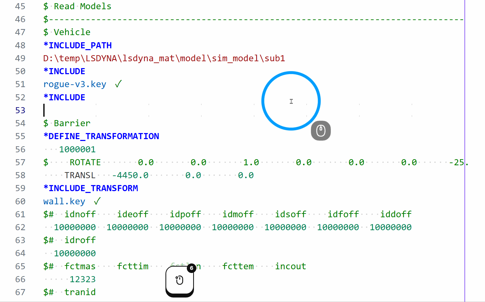
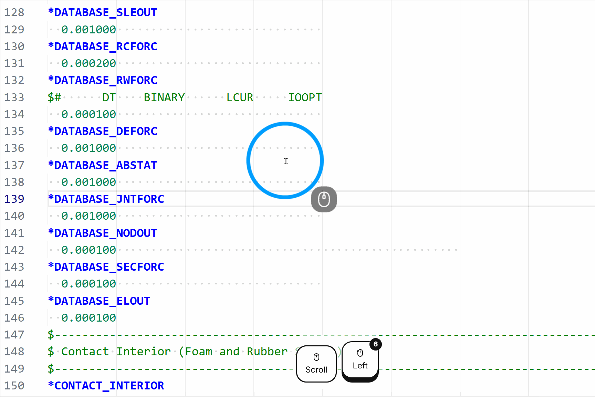
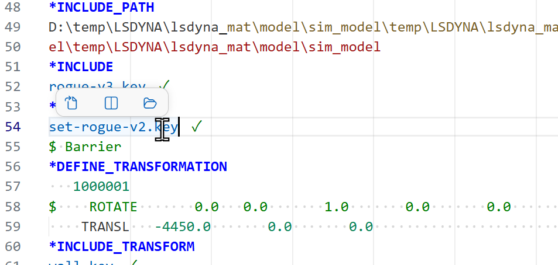
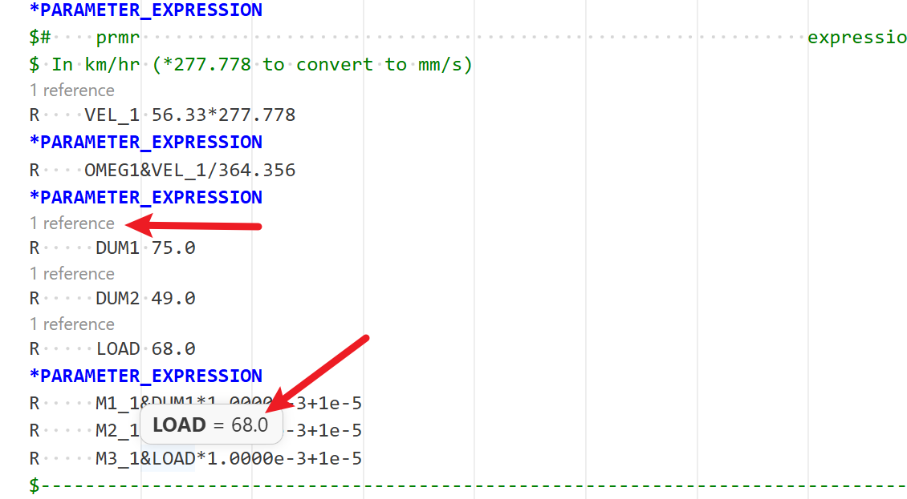
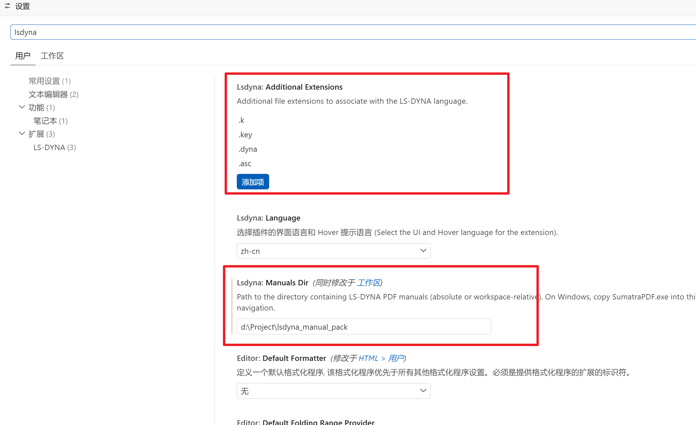

# DynaSense (for LS-DYNA)
[简体中文](README.md)


**DynaSense** is a modern and smart editor extension for LS-DYNA. It integrates LS-DYNA formatting, keyword snippets, powerful IntelliSense, and language tooling into VS Code, bringing you the ultimate authoring and project management experience.

### Installation Guide

Please visit the project's [Releases page](https://github.com/hqyyqh/vscode-lsdyna/releases) to download the latest `.vsix` extension package, and install it in VS Code via "Install from VSIX". For specific dependency configurations and FAQs, please refer to the installation guide on that page.

---

### Core Features Experience

<details open>
<summary><b>📖 Manual Integration & Interactive Query</b> (Click to expand/collapse)</summary>
<br>

- **Interactive Hover Cards**: Keyword and field hovers display links directly to the exact page of the LS-DYNA PDF manual. Click to jump instantly!
- **Instant Search**: Bookmark-based PDF manual indexing for instant search.
- **Field-level Hints**: Hover cards contain detailed descriptions of every specific field of the keyword.


</details>

<details open>
<summary><b>⚡ Smart Autocomplete & Formatting</b> (Click to expand/collapse)</summary>
<br>

- **Fast Keyword Completion**: Tab-completable snippets for common LS-DYNA keywords.
- **Smart Path Completion**: Type `/` to instantly autocomplete same-directory include files, automatically filtering invalid paths.
- **Auto Comment Generation**: Trigger field comment generation using `$` or `#`, perfectly right-aligned without trailing spaces.
- **Smart Tab Navigation**: Press `Tab` to align fields to their physical columns, loop through fields on the current line, and automatically wrap to the next line smoothly.
- **Auto Format Data Lines**: Keeps your code strictly grid-aligned, clean, and standardized.

> **Feature Demonstrations:**
> 
> | 🔑 Keyword Completion | 🛤️ Path Completion |
> | :---: | :---: |
> |  |  |
> | **📝 Quick Comment** | **📐 Smart Tab Navigation** |
> |  |  |
> | **✨ Auto Formatting** | |
> |  | |

</details>

<details>
<summary><b>📂 Include Files Management & Sidebar Tree</b> (Click to expand/collapse)</summary>
<br>

- **Status Highlighting**: `*INCLUDE` filenames are highlighted green (resolved) or orange (missing), including continued filenames and multiple files.
- **Relative Path Resolution**: Flawlessly resolves `*INCLUDE_PATH`, `*INCLUDE_PATH_RELATIVE`, and `../` styles.
- **Include Tree Sidebar Panel**: Recursively scans all include files and displays the current file's inclusion hierarchy and all used keywords in an intuitive tree view.
- **Quick Preview**: Hover actions on include file paths to quickly jump or inspect target file details.

| Include Tree Panel | Hover Quick Actions |
| :---: | :---: |
|  |  |

</details>

<details>
<summary><b>🛠️ Parameters (*PARAMETER) & Syntax Navigation</b> (Click to expand/collapse)</summary>
<br>

- **Inlay Hints**: Inline display of the final resolved value for each `&parameter` reference in real-time.
- **Reference Tracking (CodeLens)**: "N references" CodeLens above each parameter definition — click to open the References panel.
- **Global Rename**: Safely rename parameters across the entire document via the F2 key.
- **Syntax Navigation**: Syntax highlighting for `.k`, `.key`, `.dyna`, and `.cfile` files; supports jumping to next/previous keyword; each `*KEYWORD` block can be collapsed independently.



</details>

---

### Extension Settings

In addition to standard VS Code settings, this extension provides several dedicated configuration options.
*(You can search for `lsdyna` in the settings UI to adjust these)*



**LS-DYNA Dedicated Settings:**

| Setting | Default | Description |
|---|---|---|
| `lsdyna.language` | `"zh-cn"` | Select the UI and Hover language for the extension (supports `zh-cn` and `en`) |
| `lsdyna.manualsDir` | `""` | Path to the directory containing LS-DYNA PDF manuals. On Windows, copy `SumatraPDF.exe` into this folder for precise page navigation. |
| `lsdyna.additionalExtensions` | `[".k", ".key", ".dyna", ".asc"]` | Additional file extensions to associate with the LS-DYNA language |

**Recommended VS Code Settings:**

| Setting | Default | Description |
|---|---|---|
| `editor.hover.enabled` | `true` | Show keyword and field hover tooltips |
| `editor.inlayHints.enabled` | `on` | Show resolved parameter values inline |
| `editor.codeLens` | `true` | Show "N references" above parameter definitions |
| `editor.wordWrap` | `off` | Word wrap (recommended off for fixed-width columns) |

These can be scoped to LS-DYNA files only by adding them under `"[lsdyna]"` in your `settings.json`:

```json
"[lsdyna]": {
    "editor.hover.enabled": false,
    "editor.inlayHints.enabled": "off"
}
```

---

### Keyword Data

Snippets and hover documentation are generated from the [pydyna](https://github.com/ansys/pydyna) keyword database (`kwd.json`), which is maintained by Ansys and covers 3168 LS-DYNA keywords with full field definitions, types, defaults, and help text. This data is used at build time only — it is not bundled in the extension.

To regenerate after updating pydyna:

```bash
git clone https://github.com/ansys/pydyna ../pydyna
python keywords/generate_from_pydyna.py
```

### Contributing new Keywords

There are a few ways you can go about adding keywords or features:

1. Send me an email or message on Github with the desired keyword (and an example).
2. Make a pull request:
    1. Create a fork of the master.
    2. Clone [pydyna](https://github.com/ansys/pydyna) as a sibling directory (`../pydyna`).
    3. Run `python keywords/generate_from_pydyna.py` from the repo root to regenerate `snippets/lsdyna.json` from the full pydyna keyword database (3168 keywords).
    4. Create a new pull request to merge your branch into master.

## Credits & Contributors

This project is a deeply customized and refactored version maintained by [hqyyqh](https://github.com/hqyyqh).
Special thanks to the following upstream open-source projects and original authors, without whose outstanding work this project would not exist:

- **Upstream Project:** This project is forked from [osullivryan/vscode-lsdyna](https://github.com/osullivryan/vscode-lsdyna). Huge thanks to the original author and core contributors:
  - [osullivryan](https://github.com/osullivryan) (Original Author & Founder)
  - [DCHartlen](https://github.com/DCHartlen) (Core Contributor)
  - [maxiiss](https://github.com/maxiiss) (Core Contributor)
  - [yshl](https://github.com/yshl) (Contributor)
- **Database Source:** The powerful keyword and field intelligent autocomplete data heavily references and extracts from the official open-source project [ansys/pydyna](https://github.com/ansys/pydyna).
- **Other References:** Excellent ecosystem works like [vim-lsdyna](https://github.com/gradzikb/vim-lsdyna).

Thank you to all developers who have contributed to the LS-DYNA editor ecosystem!

---

> [!NOTE]
> **Customized Version Notice (Modified by hqyyqh)**
> This extension is a customized version based on the original [vscode-lsdyna](https://github.com/osullivryan/vscode-lsdyna) developed by Ryan O'Sullivan ([osullivryan](https://github.com/osullivryan)).
> - **Modifier:** hqyyqh (Modified starting May 2026)
> - **Source Code:** [hqyyqh/vscode-lsdyna](https://github.com/hqyyqh/vscode-lsdyna)
> - **License:** Distributed under the GNU General Public License v3.0 (GPL-3.0). All original licenses and credits are preserved.