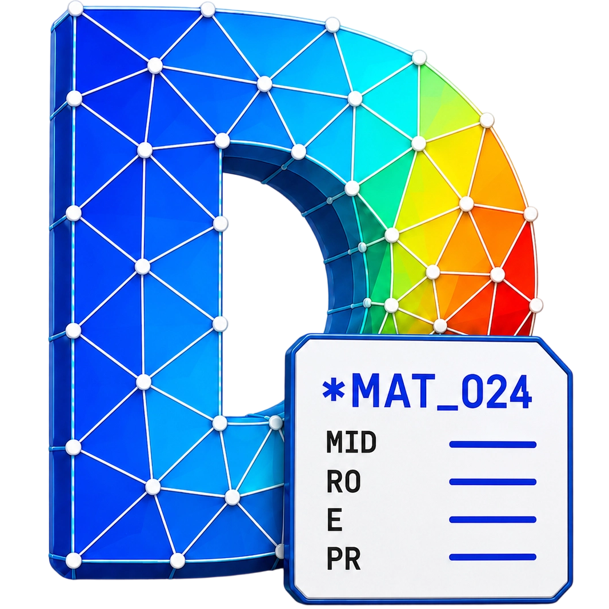
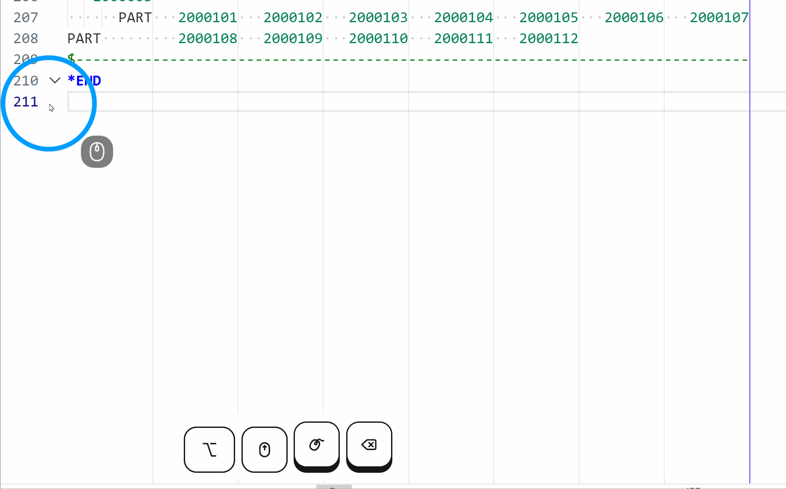
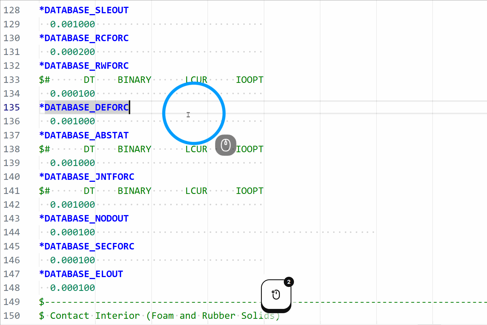
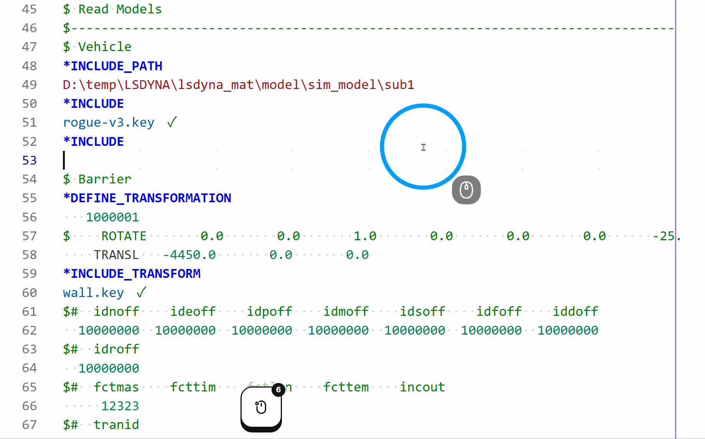
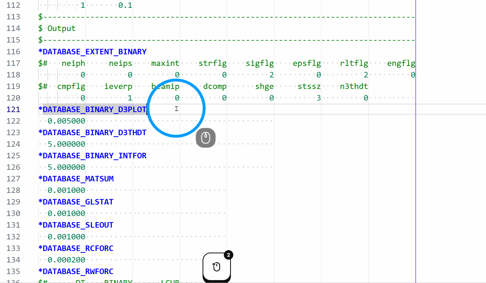
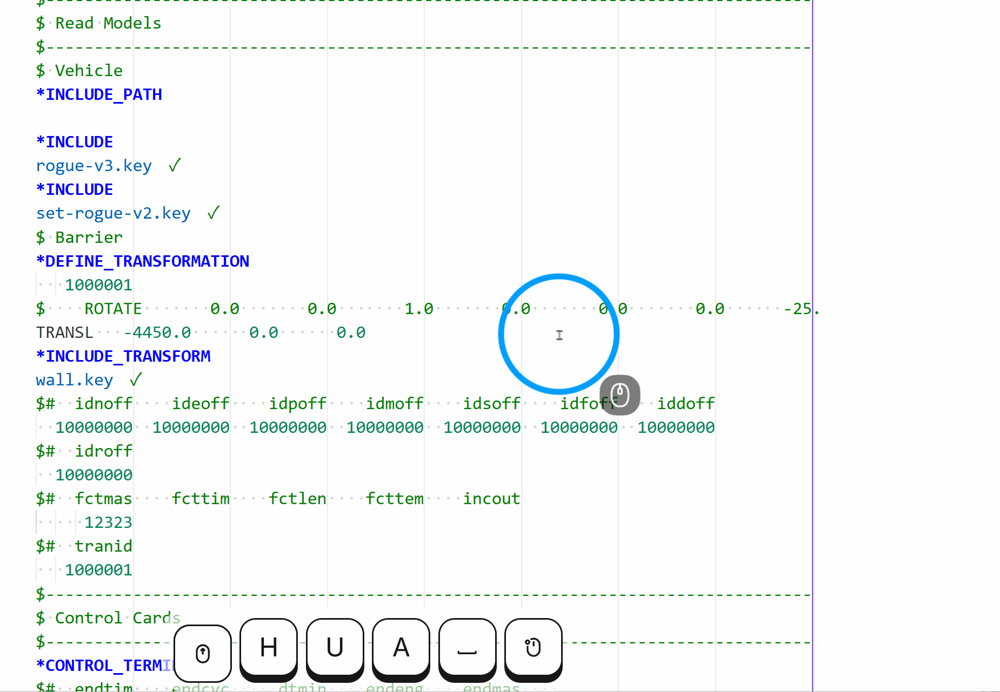
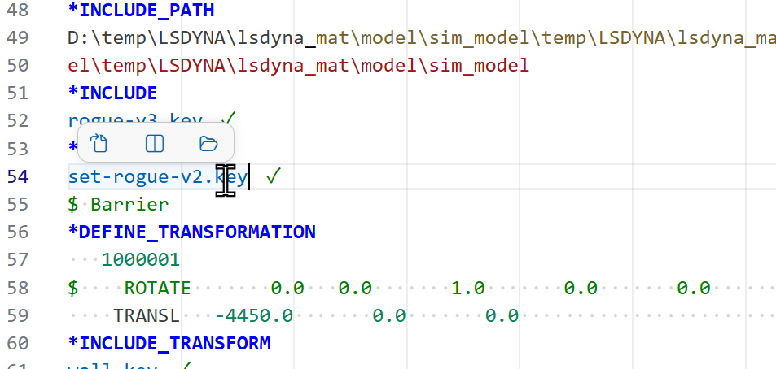
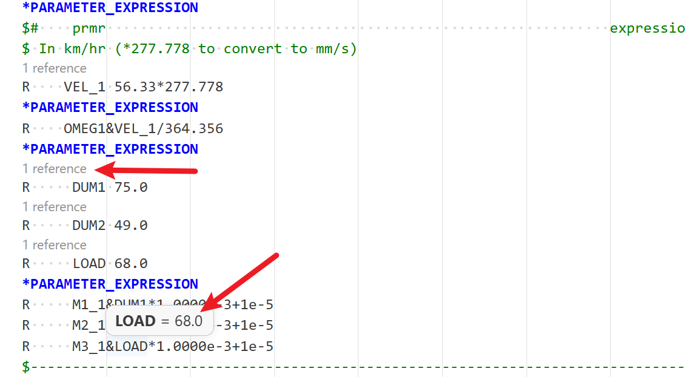

# DynaSense (LS-DYNA Studio)

  
  <h3>面向 VS Code 的 LS-DYNA 关键字文件编辑器</h3>
  
为 CAE 工程师提供关键字说明、定宽卡片编辑、引用文件树、对象预览和本地手册。

[English Version](README.md) | [中文说明](README_zh.md)

---

## 快速开始

先从 VS Code Marketplace 或 Open VSX 安装 DynaSense，然后：

1. **打开关键字文件** — 打开 `.k`、`.key` 或 `.dyna` 文件，主文件和引用文件均可。
2. **插入关键字** — 输入 `*`，从 4,700 多个关键字中选择并插入对应的卡片格式。
3. **按字段编辑** — 在数据行按 `Tab` / `Shift+Tab`。Delete 清空选中字段且不移动后续字段；经 Tab 选中后，输入只替换该字段。
4. **查看说明和引用** — 将鼠标悬停在关键字、字段、参数、曲线 ID 或表格 ID 上。
5. **扫描模型** — 打开活动栏中的 **LS-DYNA** → **引用文件树**，然后从主文件开始扫描。

| 关键字补全 | 字段说明 |
| :---: | :---: |
|  |  |

---

## 核心工作流程

### 安全地编辑关键字卡片

- 关键字和字段数据来自开源项目 [ansys/pydyna](https://github.com/ansys/pydyna)，覆盖 4,700 多个关键字。
- 代码片段可直接插入排好格式的卡片。对于支持的关键字，可通过悬停操作选择卡片、格式和可选字段。
- `Tab` 按实际的 10 字符或 8 字符字段宽度移动。到达最后一个字段后，再按 Tab 会回到**同一数据行**的第一个字段，不会新建或进入下一行。
- 输入 `$` 或 `$#` 可生成对齐的字段标题注释；`Ctrl+/` 可添加或删除 LS-DYNA 使用的 `$` 行注释标记。
- 可按需整理选中内容或整个文件。自动排版属于试验功能且默认关闭，因为它会改写卡片间距。

| 引用路径补全 | Tab 跳转 | 排版 |
| :---: | :---: | :---: |
|  |  |  |

### 管理 `*INCLUDE` 文件

- 在 `*INCLUDE` 下方的文件名行输入 `/` 或 `\`，可逐层浏览文件夹。输入文件名或其中一部分（例如 `LC_Front`），可在所有子目录中查找。选中后使用正斜杠路径，便于将模型传到 Linux。
- 从主文件扫描引用文件树后，主文件及上层引用文件中的 `*INCLUDE_PATH` 和 `*INCLUDE_PATH_RELATIVE` 会应用到下级文件。如果扫描前单独打开一个引用文件，只能使用该文件所在目录和它自己声明的路径。
- 带下划线的路径表示已在本机找到并可打开。末尾的 **!** 表示按当前已知目录未找到文件，也可能是该文件尚未同步到本机。
- 引用文件树会把真正的循环引用作为错误报告。同一个材料文件被多个上级文件引用是正常情况，不会被当作循环。
- 将鼠标悬停在路径上可预览文件开头。路径超过 LS-DYNA 三行、236 字符的限制时，会在提交计算前提示。

在 Windows 上，即使磁盘目录是 `Sub/Part.k`，`sub/part.k` 也可能正常打开；Linux 通常要求大小写完全一致。默认的 `crossPlatform` 检查会保持本地跳转并提示差异；最终提交到 Linux 前可改为 `strict` 严格检查。

| 引用文件树 | 引用文件预览 |
| :---: | :---: |
|  |  |

### 检查参数、曲线和引用对象

- 将鼠标悬停在 `&name` 上，可查看当前文件中的参数来源；扫描项目后，还可查看该参数在选定或唯一主文件环境中、当前位置实际采用的值。
- 将鼠标悬停在支持的曲线或表格引用字段上，可查看定义以及一维曲线或组合三维图形预览。如果存在多个可能目标，DynaSense 会列出候选项，不会自动选择其中一个。
- 对已确认的引用可使用**转到定义**。如果一个文件可能属于多个模型，请运行**选择主文件环境**，确保按目标模型计算继承的参数和引用。
- `F2` 可在当前文件内重命名参数；`Ctrl+Alt+Up` / `Ctrl+Alt+Down` 可跳到上一个或下一个关键字。
- 如果某个有效关键字比内置库更新，可通过悬停操作、快速修复或 DynaSense 快捷操作，把它加入“有效关键字”名单。

### 在关键字文件旁阅读本地手册

完整手册包支持关键字/标题搜索、全文搜索、章节目录、独立字号调整、阅读进度、图片放大和 PDF 页码跳转。双语包还可在有译文的章节中切换中英文并预览句子译文。阅读器会恢复上次位置，默认在关键字文件旁打开，便于对照查看。

当前下载地址见[手册配置](#手册配置)。手册包必须完整解压，阅读器需要同时使用其中的 `manifest.json`、索引、图片和 PDF 文件。

### 查看本次编辑的修改

- 无需使用 Git，也能查看本次编辑的变化：橙色或琥珀色表示尚未保存，绿色表示打开文件后已保存；不同形状用于区分修改、插入和删除的行。
- 可跳到上一个或下一个修改位置，对比打开时版本或当前未保存内容，也可以重设比较起点。
- 为保持编辑流畅，超大文件会限制扫描范围，并可自动跳过修改标记。只有确实需要完整索引时，才建议开启大文件完整扫描并接受更长的加载时间。

---

## 手册配置

由于体积较大，PDF 手册不包含在 `.vsix` 中。请下载一个完整的 **2026-08-04** 手册包：

| 手册包 | 下载 |
| --- | --- |
| **英文原版** | [下载 `lsdyna-manual-pack-en_20260804.zip`](https://github.com/hqyyqh/vscode-lsdyna/releases/download/2.0.7.3/lsdyna-manual-pack-en_20260804.zip) |
| **双语：英文原版 + 中文翻译** | [下载 `lsdyna-manual-pack-bilingual_20260804.zip`](https://github.com/hqyyqh/vscode-lsdyna/releases/download/2.0.7.3/lsdyna-manual-pack-bilingual_20260804.zip) |

> **权威性说明：** 只有 PDF 手册是官方权威资料。内置阅读器中的文字、中文翻译、悬停摘要、搜索结果和索引仅用于辅助阅读；如内容存在差异，请以 PDF 手册为准。

1. 下载一个手册包并完整解压到固定的本机目录，不要直接选择压缩包。
2. 运行**设置 LS-DYNA 手册目录**，或在 VS Code 设置中修改 `lsdyna.manualsDir`。
3. 选择解压后包含 `manifest.json` 的最外层文件夹。
4. 运行 **LS-DYNA: 打开手册阅读器**，或从活动栏的**手册**视图打开章节。

**注意事项**

- 手册包使用第三方 [SumatraPDF](https://www.sumatrapdfreader.org/free-pdf-reader) 程序打开官方 PDF 并跳到指定页；SumatraPDF **仅支持 Windows**。
- VS Code 内置手册阅读器仍可在 Windows、macOS 和 Linux 上使用。非 Windows 系统会调用默认 PDF 阅读器，是否能准确跳到指定页取决于该阅读器。
- 请保持解压后的内部目录结构不变。可以移动或重命名最外层文件夹，但不要重命名或删除其中的 `manifest.json`、索引、图片或 PDF 文件，否则可能影响搜索、图片显示或 PDF 链接。
- 英文包只包含英文原版；需要中文内容和译文预览时，请安装双语包。

---

## 常用设置

在 VS Code 设置中搜索 `LS-DYNA`。多数用户只需关注以下选项：

| 设置 | 默认值 | 何时调整 |
| :--- | :--- | :--- |
| `lsdyna.manualsDir` | `"lsdyna_manual_pack"` | 选择完整解压且包含 `manifest.json` 的手册包文件夹。 |
| `lsdyna.include.pathCaseCheck` | `"crossPlatform"` | 提交到 Linux 且必须严格匹配大小写时，改为 `strict`。 |
| `lsdyna.enableTabNavigation` | `true` | 如需恢复普通 Tab 空格则关闭。 |
| `lsdyna.enableCellEditProtect` | `true` | 防止 Delete/Backspace 导致后续定宽字段向前移动。 |
| `lsdyna.enableFieldHover` | `true` | 希望界面更安静时关闭；引用路径、关键字和参数说明仍会保留。 |
| `lsdyna.unknownKeywordSeverity` | `"error"` | 求解器版本比内置库更新时，可降为警告、提示或关闭。 |
| `lsdyna.scanner.fullScanLargeFiles` | `false` | 只有需要超大文件的完整索引时才开启。 |
| `lsdyna.language` | `"auto"` | 修改扩展界面语言；手册内容仍由安装的手册包决定。 |

<strong>高级选项与外观</strong>

为满足发布校核并方便高级用户，下面保留完整设置索引；日常使用通常不需要修改这些默认值。

| 设置 | 默认值 | 用途 |
| :--- | :--- | :--- |
| `lsdyna.changeMarks.enabled` | `true` | 显示本次编辑产生的修改。 |
| `lsdyna.changeMarks.maxLineCount` | `100000` | 文件超过此行数时跳过修改标记。 |
| `lsdyna.changeMarks.debounceMs` | `250` | 编辑后等待相应毫秒数再刷新标记。 |
| `lsdyna.changeMarks.showOverviewRuler` | `true` | 在编辑器右侧概览尺显示修改。 |
| `lsdyna.changeMarks.showLineBackground` | `true` | 为修改行增加浅色背景。 |
| `lsdyna.changeMarks.showMinimap` | `true` | 在缩略图中显示已保存和未保存的修改。 |
| `lsdyna.navigation.pulseOnJump` | `true` | 跳转后短暂突出显示目标位置。 |
| `lsdyna.statusBar.level` | `"simple"` | 选择关闭、简要或详细的当前文件状态。 |
| `lsdyna.health.showFirstRunNotice` | `true` | 首次使用时显示一次配置提示。 |
| `lsdyna.largeFile.enableRendering` | `true` | 仅在超大文件上需要节省资源时关闭附加显示。 |
| `lsdyna.codeLens.showOnAllKeywords` | `false` | 在每个关键字上方显示附加操作。 |
| `lsdyna.hover.previewMaxLines` | `20` | 限制引用文件预览的行数。 |
| `lsdyna.autoFormat` | `"disabled"` | 离开数据行后自动整理卡片的试验功能。 |
| `lsdyna.additionalExtensions` | `[".k",".key",".dyna",".asc"]` | 按 LS-DYNA 关键字文件处理的扩展名。 |
| `lsdyna.ignoreFormattingKeywords` | `[]` | 不参与排版和字段操作的关键字。 |
| `lsdyna.customValidKeywords` | `["*END","*TITLE","*CASE_BEGIN","*CASE_END"]` | 不应被报告为未知的已确认关键字。 |
| `lsdyna.warnLowercaseKeyword` | `false` | 关键字不是大写时发出提示。 |

自定义扩展名还应配置 VS Code 的 `files.associations`，例如 `"*.my_ext": "lsdyna"`。本次修改标记和其他界面元素会跟随 VS Code 主题；可在 `workbench.colorCustomizations` 中使用 `lsdyna.changeMarks.unsaved` 和 `lsdyna.changeMarks.saved` 覆盖修改标记颜色。

> **提交模型前：** 从正确的主文件扫描引用文件树 → 处理所有缺失的 **!** → 消除循环引用 → 提交到 Linux 时严格检查路径大小写 → 确认提交目录与扫描时使用的 `*INCLUDE_PATH` 结构一致。

---

## 致谢与贡献者

本项目由 [hqyyqh](https://github.com/hqyyqh) 维护，是对 LS-DYNA VS Code 编辑器生态的深度定制。

- **上游项目：** [osullivryan/vscode-lsdyna](https://github.com/osullivryan/vscode-lsdyna)；感谢 [osullivryan](https://github.com/osullivryan)、[DCHartlen](https://github.com/DCHartlen)、[maxiiss](https://github.com/maxiiss) 和 [yshl](https://github.com/yshl)。
- **关键字数据：** [ansys/pydyna](https://github.com/ansys/pydyna)。
- **参考项目：** [vim-lsdyna](https://github.com/gradzikb/vim-lsdyna) 以及其他 LS-DYNA 编辑器社区项目。
